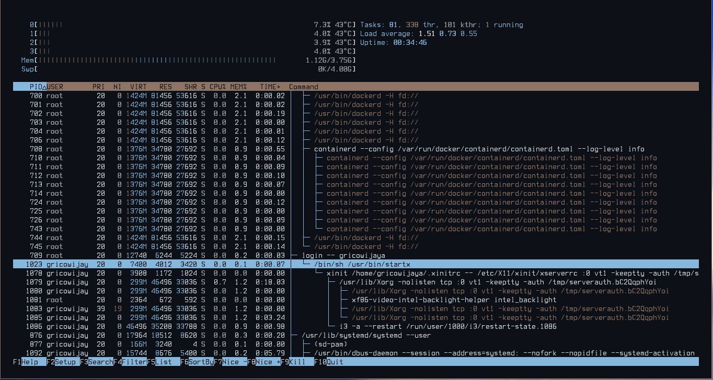

## Konsep dasar dan definisi teori mengenai OS. 

Apakah itu _Process_ ? 

Proses adalah unit terkecil yang secara individu memiliki sumber daya dan dijadwalkan oleh sistem operasi. Akan ada jika dimana sebuah aplikasi berjalan di layer _software_ yang dimana nantinya akan menjadikan Proses ID.  

Proses itu tidak sama dengan kode program yang melainkan sebuah aktivitas yang dijalankan oleh pengguna sehingga nantinya akan terdapat proses register yang ada pada mesin. Sementara kode program tersebut adalah sebuah barisan perintah yang nantinya akan memanggil atau memiliki perintah-perintah _hardware_.  

Suatu proses umumnya termasuk process stack yang dimana terdapat data temporer atau alamat yang kembali atau sebuah variabel. Berisi data temporer (parameter metode, address yang kembali, variabel lokal) dan sebuah data section yang berisikan variabel global.

Seperti misalnya aplikasi Firefox yang dimana akan memiliki proses karena binarynya akan berjalan diatas sebuah sistem layer _Operating System_.

## Mengapa Proses Bukanlah Kode Program.

Sebuah proses itu tersebut memiliki sebuah urutan eksekusi yang dimana sesuai dengan aplikasinya misalnya sebuah proses X dan proses Y ketika akan muncul dari dijalankan program I, baik oleh 1 pengguna maupun banyak pengguna. Dari program tersebut dapat dijalankan oleh sebuah eksekusi akan memiliki banyak proses yang berbeda-beda yang dimana juga satu proses tersebut akan memiliki sebuah proses lainnya.   

## 5 Kondisi Proses

- New $ proses sedang dikerjakan / dibuat.
- Runinng $ instruksi sedang dikerjakan.
- Waiting $ proses yang sedang menunggu sejumlah kejadian untuk terjadi (seperti sebuah penyelesaian I/O atau penerimaan sebuah tanda/signal).
  seperti misalnya ketika menjalankan beberapa perintah yang dimana digunakan untuk menjalankan beberapa perintah secara berbarengan sehingga nantinya setiap proses tersebut akan menunggu satu sama lainnya untuk menjadikan setiap state proses agar menjadi ready. Tergantung sebuah kondisi yang dijalankan  
  Tetapi kondisi-kondisi.
- Ready $ proses yang sedang mengunggu untuk ditugaskan pada sebuah prosesor.
- Terminated $ proses telah selesai melaksakan tugasnya/mengeksekusi.

## PCB (Process Control Box) 

Terdapat sebuah proses yang dimana ada sebuah kondisi yang dimana memiliki blok-blok proses nya yang ada pada sistem operasi.

Informasi yang ada itu terdapat 6 proses : 

1. Keadaan proses <br> 
 New, ready, running, waiting, halted, dll, proses yang paling awal.

2. _Program Counter_<br>
Mengindikasi address dari perintah selanjutnya untuk dijalan untuk proses ini.

3. _CPU Register_ <br>
Register yang bervariasi dalam jumlah dan jenis, tergantung dari arsitektur dan rancangan komputer. seperti **rax, iax, eax, accumulator, dan general purposes register,** dan lain-lainnya. Register ini digunakan untuk menyimpan sebuah data atau sebuah fungsi dari program yang akan dijalankan sehingga nantinya mesin akan membaca register tersebut dan nantinya akan diproses oleh mesin untuk menjalankan perintah berdasarkan register tersebut.

4. Informasi Management Memori. <br>
Sebuah pengelolaan memori komputer yang dimana melakukn alokasi memmori atas permintaan serta membebaskan untuk digunakan kembali ketika tidak lagi diperlukannya ruangan memori tersebut. 

5. Informasi pencatatan <br>

Meliputi jumah dari CPU dan waktu rii yang digunakanjka, batas waktu, jumlah akun, jumlah job atau proses.

Penciptaan proses atau terminasi proses atau ternyata ketika sudah memperlunak atau anda sudah tidak memerlukan aplikasi atau proses init. 
Dari daftar-daftar berkas yang telah dibuka tersebut akan membuka.
Seperti misalnya pada aplikasi pertamanya terdapat servernya yang dimana nantinya dapat digunakan sebuah aplikasi layernya.
Kemudian yang kedua dapat mengakses sebuah proses yang dimana terdapat sebuah client yang terdistribusi. Jika di level aplikasi ini terdapat sebuah.
Mengenai pembahasan dari proses dapat diketahui bahwa sebuah proses akan diberikan dari sebuah minimalnya terdapat sebuah proses mutlak ada ketika menjalanakan sebuah sistem aplikasi atau pun sistem operasi. Seperti ketika menginstall apache web server ketika dilakukan up yang pertama kali maka akan bekerja dari hal tersebut dengan sebuah system daemon. Seperti pada tampilan-tampilan tersebut ada beberapa _service_ atau antivirus.

Gunakan program top dan htop agar dapat menggunakan sebuah _kill system_ dapat melakukan tindakan yang mengontrol melewai TUI (Terminal User Interface sehingga dapat dilihat proses mana yang harus dihapus dan tidak dihapus.) 

## Cara Penggunaan htop dan top

Untuk dapat melihat PID dengan menggunakan _Process viewer_ untuk melakukan monitoring terhadap sistem operasi yang sedang dijalani adalah dengan menggunakan terminal _user interface_. Mengapa ? jawabannya adalah karena ringan dibanding dengan menggunakan sebuah _graphical user interface_ untuk melakukan monitoring terhadap sistem. Untuk dapat menjalankan linux top adalah dengan melakukan _command_ : 

```bash
top
```

sehingga nantinya akan menghasilkan tampilan seperti dibawah ini

 <br>
*Tampilan dari Program "top"*

Dalam mengambil process tersebut saya menggunakan program _screen capture_ yang bernama **flameshot** dalam program tersebut terdapat beberapa process dan terlihat pada bagian atas tersebut terdapat nama *flameshot* dengan process id 9488. Selain dengan menggunakan top kita juga dapat menggunakan htop yang dimana lebih mendetail serta lebih menarik untuk dilakukan _monitoring process_ yang nantinya dapat dilakukan sebuah _killing process_ untuk menghentikan process yang tidak diperlukan tetapi tidak terdapat gui _interface_ untuk mematikan _process_ tersebut untuk menggunakan top dapat menggunakan command :

```bash
htop
```

sehingga nantinya akan menghasilkan tampilan seperti dibawah ini

 <br>
*Tampilan dari Program "htop"*

htop akan menghasilkan tampilan yang lebih detail sehingga pengguna dapat lebih mudah dalam mendeteksi _process_ apakah yang membuat komputer menjadi lambat ataupun ingin mengetahui mengapa suatu program gagal dijalankan. 


## Alternatif lain 

Selain dengan menggunakan htop dan top pengguna juga dapat menggunakan bpytop ataupun gtop untuk nilai estetika dan juga dapat melihat _process-process_ yang terjadi pada OS linux. Navigasi pada bpytop ataupun g top memiliki kesamaan _key-binding_ dengan navigasi _vim_. Tampilan dari bpytop adalah sebagai berikut 

```bash
bpytop
```

 <br>
*Tampilan dari Program "bpytop"*

Dari tampilan diatas kita juga dapat melakukan monitoring terhadap _network_ dan juga kinerja dari CPU sehingga dapat diketahui apakah mesin yang digunakan dapat dilihat _process_ nya secara lebih detail. 
